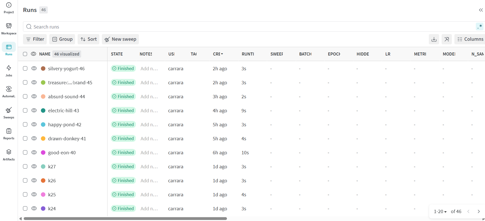
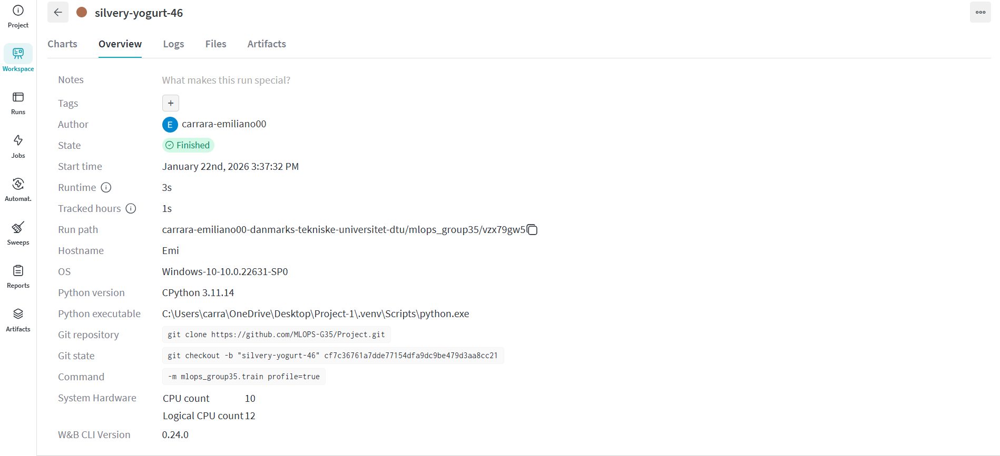
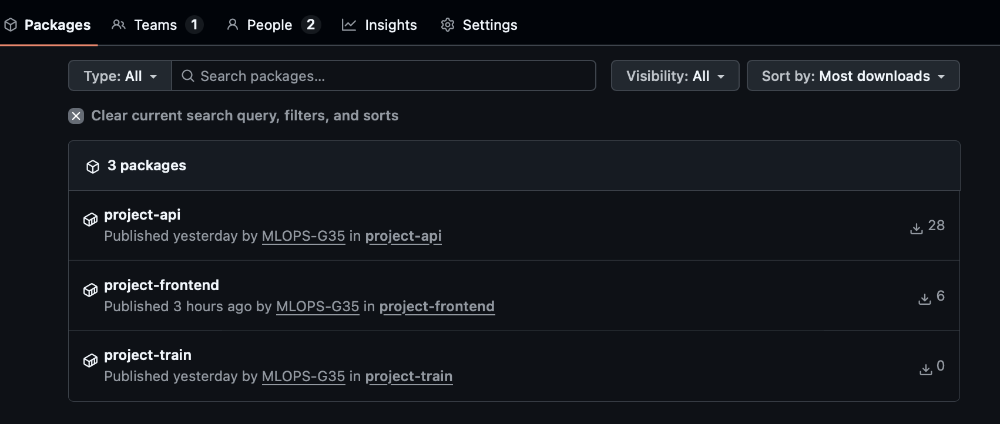
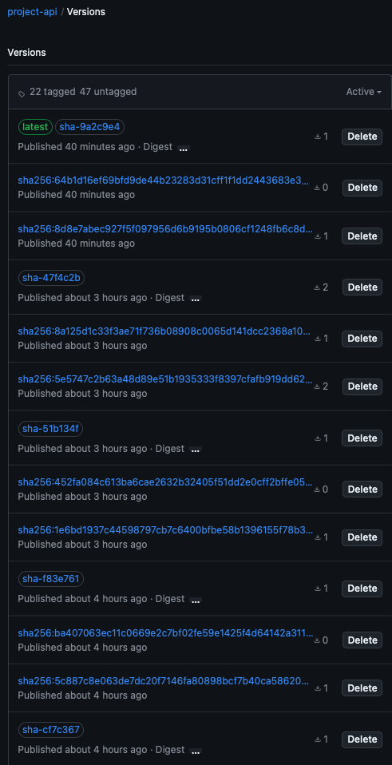
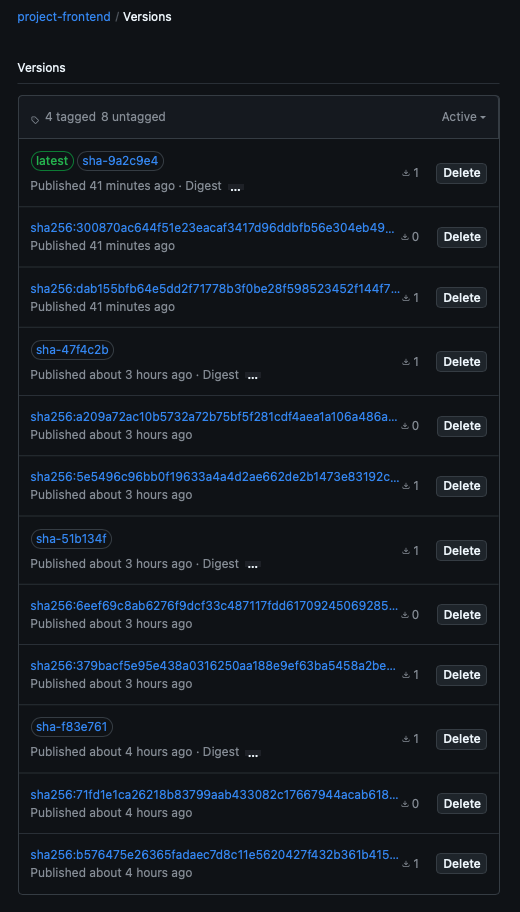

# Exam template for 02476 Machine Learning Operations

This is the report template for the exam. Please only remove the text formatted as with three dashes in front and behind
like:

```--- question 1 fill here ---```

Where you instead should add your answers. Any other changes may have unwanted consequences when your report is
auto-generated at the end of the course. For questions where you are asked to include images, start by adding the image
to the `figures` subfolder (please only use `.png`, `.jpg` or `.jpeg`) and then add the following code in your answer:

``

In addition to this markdown file, we also provide the `report.py` script that provides two utility functions:

Running:

```bash
python report.py html
```

Will generate a `.html` page of your report. After the deadline for answering this template, we will auto-scrape
everything in this `reports` folder and then use this utility to generate a `.html` page that will be your serve
as your final hand-in.

Running

```bash
python report.py check
```

Will check your answers in this template against the constraints listed for each question e.g. is your answer too
short, too long, or have you included an image when asked. For both functions to work you mustn't rename anything.
The script has two dependencies that can be installed with

```bash
pip install typer markdown
```

or

```bash
uv add typer markdown
```

## Overall project checklist

The checklist is *exhaustive* which means that it includes everything that you could do on the project included in the
curriculum in this course. Therefore, we do not expect at all that you have checked all boxes at the end of the project.
The parenthesis at the end indicates what module the bullet point is related to. Please be honest in your answers, we
will check the repositories and the code to verify your answers.

### Week 1

* [ ] Create a git repository (M5)
* [ ] Make sure that all team members have write access to the GitHub repository (M5)
* [ ] Create a dedicated environment for you project to keep track of your packages (M2)
* [ ] Create the initial file structure using cookiecutter with an appropriate template (M6)
* [ ] Fill out the `data.py` file such that it downloads whatever data you need and preprocesses it (if necessary) (M6)
* [ ] Add a model to `model.py` and a training procedure to `train.py` and get that running (M6)
* [ ] Remember to either fill out the `requirements.txt`/`requirements_dev.txt` files or keeping your
    `pyproject.toml`/`uv.lock` up-to-date with whatever dependencies that you are using (M2+M6)
* [ ] Remember to comply with good coding practices (`pep8`) while doing the project (M7)
* [ ] Do a bit of code typing and remember to document essential parts of your code (M7)
* [ ] Setup version control for your data or part of your data (M8)
* [ ] Add command line interfaces and project commands to your code where it makes sense (M9)
* [ ] Construct one or multiple docker files for your code (M10)
* [ ] Build the docker files locally and make sure they work as intended (M10)
* [ ] Write one or multiple configurations files for your experiments (M11)
* [ ] Used Hydra to load the configurations and manage your hyperparameters (M11)
* [ ] Use profiling to optimize your code (M12)
* [ ] Use logging to log important events in your code (M14)
* [ ] Use Weights & Biases to log training progress and other important metrics/artifacts in your code (M14)
* [ ] Consider running a hyperparameter optimization sweep (M14)
* [ ] Use PyTorch-lightning (if applicable) to reduce the amount of boilerplate in your code (M15)

### Week 2

* [ ] Write unit tests related to the data part of your code (M16)
* [ ] Write unit tests related to model construction and or model training (M16)
* [ ] Calculate the code coverage (M16)
* [ ] Get some continuous integration running on the GitHub repository (M17)
* [ ] Add caching and multi-os/python/pytorch testing to your continuous integration (M17)
* [ ] Add a linting step to your continuous integration (M17)
* [ ] Add pre-commit hooks to your version control setup (M18)
* [ ] Add a continues workflow that triggers when data changes (M19)
* [ ] Add a continues workflow that triggers when changes to the model registry is made (M19)
* [ ] Create a data storage in GCP Bucket for your data and link this with your data version control setup (M21)
* [ ] Create a trigger workflow for automatically building your docker images (M21)
* [ ] Get your model training in GCP using either the Engine or Vertex AI (M21)
* [ ] Create a FastAPI application that can do inference using your model (M22)
* [ ] Deploy your model in GCP using either Functions or Run as the backend (M23)
* [ ] Write API tests for your application and setup continues integration for these (M24)
* [ ] Load test your application (M24)
* [ ] Create a more specialized ML-deployment API using either ONNX or BentoML, or both (M25)
* [ ] Create a frontend for your API (M26)

### Week 3

* [ ] Check how robust your model is towards data drifting (M27)
* [ ] Setup collection of input-output data from your deployed application (M27)
* [ ] Deploy to the cloud a drift detection API (M27)
* [ ] Instrument your API with a couple of system metrics (M28)
* [ ] Setup cloud monitoring of your instrumented application (M28)
* [ ] Create one or more alert systems in GCP to alert you if your app is not behaving correctly (M28)
* [ ] If applicable, optimize the performance of your data loading using distributed data loading (M29)
* [ ] If applicable, optimize the performance of your training pipeline by using distributed training (M30)
* [ ] Play around with quantization, compilation and pruning for you trained models to increase inference speed (M31)

### Extra

* [ ] Write some documentation for your application (M32)
* [ ] Publish the documentation to GitHub Pages (M32)
* [ ] Revisit your initial project description. Did the project turn out as you wanted?
* [ ] Create an architectural diagram over your MLOps pipeline
* [ ] Make sure all group members have an understanding about all parts of the project
* [ ] Uploaded all your code to GitHub

## Group information

### Question 1
> **Enter the group number you signed up on <learn.inside.dtu.dk>**
>
> Answer:

--- question 1 fill here ---

### Question 2
> **Enter the study number for each member in the group**
>
> Example:
>
> *sXXXXXX, sXXXXXX, sXXXXXX*
>
> Answer:

--- question 2 fill here ---

### Question 3
> **Did you end up using any open-source frameworks/packages not covered in the course during your project? If so**
> **which did you use and how did they help you complete the project?**
>
> Recommended answer length: 0-200 words.
>
> Example:
> *We used the third-party framework ... in our project. We used functionality ... and functionality ... from the*
> *package to do ... and ... in our project*.
>
> Answer: We did not use any third-party frameworks/packages that were not cover in the course. 

--- question 3 fill here ---

## Coding environment

> In the following section we are interested in learning more about you local development environment. This includes
> how you managed dependencies, the structure of your code and how you managed code quality.

### Question 4

> **Explain how you managed dependencies in your project? Explain the process a new team member would have to go**
> **through to get an exact copy of your environment.**
>
> Recommended answer length: 100-200 words
>
> Example:
> *We used ... for managing our dependencies. The list of dependencies was auto-generated using ... . To get a*
> *complete copy of our development environment, one would have to run the following commands*
>
> Answer: 

We used uv for managing our Python dependencies.
The list of dependencies was auto-generated and locked using pyproject.toml and uv.lock.
To get a complete copy of our development environment, a new team member would:
```bash
git clone https://github.com/MLOPS-G35/Project.git
cd project
uv sync
```
This installs the exact same dependency versions used in the project, ensuring a consistent environment across all machines.

### Question 5

> **We expect that you initialized your project using the cookiecutter template. Explain the overall structure of your**
> **code. What did you fill out? Did you deviate from the template in some way?**
>
> Recommended answer length: 100-200 words
>
> Example:
> *From the cookiecutter template we have filled out the ... , ... and ... folder. We have removed the ... folder*
> *because we did not use any ... in our project. We have added an ... folder that contains ... for running our*
> *experiments.*
>
> Answer:

The project was initialized using the official "cookiecutter" template provided.
The main source code is in src/mlops_group35/, and it contains data management (data.py), model logic (model.py), training (train.py), API deployment (api.py), and drift detection (drift.py, drift_runtime.py, drift_check.py).

We populated the data/ folder with the raw/ and processed/ subdirectories, where the dataset is stored and we generated a combined preprocessed CSV file. The tests/ directory contains unit and integration tests. dockerfiles/ includes separate Dockerfiles for training and API inference, following best practices. 
The outputs (like profiling results and drift reports) are stored in the reports/ folder. The pictures for the exam report are stored in reports/figures/.

We deviated from the template by not introducing DVC-related folders or tooling. Given the small size of the dataset, we chose not to set up a dedicated data versioning system.
Additionally, we added scripts and report files for drift detection, which were not part of the original template but were needed to support both offline analysis and runtime checks.

### Question 6

> **Did you implement any rules for code quality and format? What about typing and documentation? Additionally,**
> **explain with your own words why these concepts matters in larger projects.**
>
> Recommended answer length: 100-200 words.
>
> Example:
> *We used ... for linting and ... for formatting. We also used ... for typing and ... for documentation. These*
> *concepts are important in larger projects because ... . For example, typing ...*
>
> Answer:

We used a linting tool to enforce basic code quality rules and catch common errors. In addition, we set up GitHub
hooks to prevent commits that did not meet our project’s standards. For documentation, we used MkDocs to create 
clear and structured project documentation.

## Version control

> In the following section we are interested in how version control was used in your project during development to
> corporate and increase the quality of your code.

### Question 7

> **How many tests did you implement and what are they testing in your code?**
>
> Recommended answer length: 50-100 words.
>
> Example:
> *In total we have implemented X tests. Primarily we are testing ... and ... as these the most critical parts of our*
> *application but also ... .*
>
> Answer:

In total, we have implemented 8 tests. Primarily we are testing the train process, data process, and API. These are the
most critical parts of our system.

### Question 8

> **What is the total code coverage (in percentage) of your code? If your code had a code coverage of 100% (or close**
> **to), would you still trust it to be error free? Explain you reasoning.**
>
> Recommended answer length: 100-200 words.
>
> Example:
> *The total code coverage of code is X%, which includes all our source code. We are far from 100% coverage of our **
> *code and even if we were then...*
>
> Answer:
The total code coverage of the code is around 44%. 
100% code coverage means that in the tests, all of our code executed. However, it does not say anything about
whether they are tested correctly. Hence, we will not trust that it's error, not even if all code are tested correctly.


### Question 9

> **Did you workflow include using branches and pull requests? If yes, explain how. If not, explain how branches and**
> **pull request can help improve version control.**
>
> Recommended answer length: 100-200 words.
>
> Example:
> *We made use of both branches and PRs in our project. In our group, each member had an branch that they worked on in*
> *addition to the main branch. To merge code we ...*
>
> Answer:

We created one branch for each task in our project. Once a task was completed, it was merged into the main branch.
Occasionally, we created pull requests, but since we were only two team members and both had solid experience 
in software development, we agreed that formal code reviews were not always necessary. Therefore, we often merged 
our changes directly into main without using pull requests.

### Question 10

> **Did you use DVC for managing data in your project? If yes, then how did it improve your project to have version**
> **control of your data. If no, explain a case where it would be beneficial to have version control of your data.**
>
> Recommended answer length: 100-200 words.
>
> Example:
> *We did make use of DVC in the following way: ... . In the end it helped us in ... for controlling ... part of our*
> *pipeline*
>
> Answer:

No, we didn't use DVC because the dataset is too small and static, so it's already available in preprocessed form. Therefore, it's not necessary to introduce a data versioning system into the project. Data management remained simple.
DVC would have been useful if the data had changed over time, was large in size, or was generated with complex pipelines. In those cases, we could have versioned the datasets along with the code without having to save them in Git, thus reproducing experiments by associating a specific version of the code with a specific version of the data. Furthermore, DVC helps facilitate data tracking, compare different versions of the dataset, and integrate with remote storage.

### Question 11

> **Discuss you continuous integration setup. What kind of continuous integration are you running (unittesting,**
> **linting, etc.)? Do you test multiple operating systems, Python  version etc. Do you make use of caching? Feel free**
> **to insert a link to one of your GitHub actions workflow.**
>
> Recommended answer length: 200-300 words.
>
> Example:
> *We have organized our continuous integration into 3 separate files: one for doing ..., one for running ... testing*
> *and one for running ... . In particular for our ..., we used ... .An example of a triggered workflow can be seen*
> *here: <weblink>*
>
> Answer:

We used GitHub Actions to set up continuous integration for our project. CI runs automatically with every push request, and pull verifies that the code works correctly and follows the same style throughout the project.
All workflows are stored in the .github/workflows/ directory.
The CI pipeline runs unit tests using pytest. These tests focus on the most important parts of the code (the data processing logic, the training script, and the core API features).
We also measure code coverage with pytest-cov.
In addition to tests, CI includes linting and formatting checks.
We use Ruff to detect common code issues and Black to ensure consistent code formatting.
CI uses a matrix setup to run tests on multiple operating systems, including Linux, Windows, and macOS.
All jobs use Python 3.11, which matches our local development environment.
We've also enabled dependency caching for packages managed with uv, reducing the execution time of repeated CI runs.

For verifiability:
.github/workflows/ directory in the repository
Successful runs visible in the GitHub Actions tab

## Running code and tracking experiments

> In the following section we are interested in learning more about the experimental setup for running your code and
> especially the reproducibility of your experiments.

### Question 12

> **How did you configure experiments? Did you make use of config files? Explain with coding examples of how you would**
> **run a experiment.**
>
> Recommended answer length: 50-100 words.
>
> Example:
> *We used a simple argparser, that worked in the following way: Python  my_script.py --lr 1e-3 --batch_size 25*
>
> Answer:

We configured our experiments using Hydra and YAML configuration files. All experiment settings are defined in configs/cluster.yaml so that hyperparameters can be modified without modifying the source code.
Experiments are run via a command line interface, and parameters can be overridden directly from the command line.

For example:
"uv run python -m mlops_group35.train n_clusters=3 profile=true"

This configuration simplifies execution and ensures reproducibility when comparing different configurations.

### Question 13

> **Reproducibility of experiments are important. Related to the last question, how did you secure that no information**
> **is lost when running experiments and that your experiments are reproducible?**
>
> Recommended answer length: 100-200 words.
>
> Example:
> *We made use of config files. Whenever an experiment is run the following happens: ... . To reproduce an experiment*
> *one would have to do ...*
>
> Answer:

We ensured the reproducibility of our experiments primarily through:
- configuration management
- experiment logging and tracking.

All experiment parameters are defined using Hydra configuration files, so each run is fully described by a specific configuration state.

Hydra automatically records the parameter configuration used for each experiment.

We also use Weights & Biases (W&B). During training, we record important metrics such as:
- inertia (KMeans)
- silhouette score
- number of clusters
- runtime/profiling information.
These logs are stored along with the configuration and metadata for each run.
This simplifies comparisons between different runs and parameters.

The code is also version-controlled via Git, so each experiment can be associated with a specific source code commit.

To reproduce an experiment, you can check out the same Git commit, use the same configuration file (or the same Hydra overrides), and rerun the training command.

### Question 14

> **Upload 1 to 3 screenshots that show the experiments that you have done in W&B (or another experiment tracking**
> **service of your choice). This may include loss graphs, logged images, hyperparameter sweeps etc. You can take**
> **inspiration from [this figure](figures/wandb.png). Explain what metrics you are tracking and why they are**
> **important.**
>
> Recommended answer length: 200-300 words + 1 to 3 screenshots.
>
> Example:
> *As seen in the first image when have tracked ... and ... which both inform us about ... in our experiments.*
> *As seen in the second image we are also tracking ... and ...*
>
> Answer:

We used Weights & Biases (W&B) to monitor and visualize our experiments during model training. The following screenshots show an overview of multiple training runs, as well as detailed visualizations of individual experiment metrics. This allowed us to compare different configurations and better understand the behavior of our KMeans clustering model.



The first image shows an overview of all the W&B project runs.
Each row corresponds to a different training run, executed with different configurations.
From this view, we can easily see:
- the status of each run
- the execution time
- the execution date of the experiments
This overview helps us compare runs and verify that multiple experiments have been run in a structured and consistent manner.



The second image shows a detailed overview of a single run.
Here, W&B automatically records important metadata:
- the executed command
- the operating system
- the Python version
- the Git repository and commit hash
This information is essential for reproducibility, as it allows us to know the exact version of the code and the execution environment for each experiment.

### Question 15

> **Docker is an important tool for creating containerized applications. Explain how you used docker in your**
> **experiments/project? Include how you would run your docker images and include a link to one of your docker files.**
>
> Recommended answer length: 100-200 words.
>
> Example:
> *For our project we developed several images: one for training, inference and deployment. For example to run the*
> *training docker image: `docker run trainer:latest lr=1e-3 batch_size=64`. Link to docker file: <weblink>*
>
> Answer:

For our project, we developed several Docker images: one for the API, one for the frontend, and one for training.
We used docker images for CI to the VM-whenever changes occur in branch main, we build new images and deploy them to vm 
automatically by using Github actions.

To run the API Docker image:\
docker run -d --restart unless-stopped -p 8000:8000 ghcr.io/mlops-g35/project-api

Link to the Docker images and files:\
https://github.com/orgs/MLOPS-G35/packages?repo_name=Project

### Question 16

> **When running into bugs while trying to run your experiments, how did you perform debugging? Additionally, did you**
> **try to profile your code or do you think it is already perfect?**
>
> Recommended answer length: 100-200 words.
>
> Example:
> *Debugging method was dependent on group member. Some just used ... and others used ... . We did a single profiling*
> *run of our main code at some point that showed ...*
>
> Answer:

Debugging method was dependent on group member. Some used Intellij Debugger and others used VS Code.

Even though our dataset is not very large and does not take much time to run the application, we still ran the profiling tool.
The results showed that there was room for improvement.


## Working in the cloud

> In the following section we would like to know more about your experience when developing in the cloud.

### Question 17

> **List all the GCP services that you made use of in your project and shortly explain what each service does?**
>
> Recommended answer length: 50-200 words.
>
> Example:
> *We used the following two services: Engine and Bucket. Engine is used for... and Bucket is used for...*
>
> Answer:

We used Google Compute Engine to train, and host and run our backend API and frontend application.

We used Cloud Networking (including firewall rules and external IPs) to expose the applications to the internet 
and allow users to access the system.


### Question 18

> **The backbone of GCP is the Compute engine. Explained how you made use of this service and what type of VMs**
> **you used?**
>
> Recommended answer length: 100-200 words.
>
> Example:
> *We used the compute engine to run our ... . We used instances with the following hardware: ... and we started the*
> *using a custom container: ...*
>
> Answer:

We used Google Cloud Compute Engine as the backbone of our infrastructure to deploy and run our application in a 
scalable and reliable environment. Compute Engine allowed us to create virtual machine (VM) instances with the exact 
specifications needed for our workload, while benefiting from Google’s global infrastructure and security features.
For our project, we used an e2-small VM instance, which provides 2 vCPUs and 2 GB of memory. The instance ran on 
an Intel Broadwell CPU platform with an x86/64 architecture. This machine type was suitable for our lightweight 
application requirements, offering a good balance between performance and cost efficiency.
We did not require GPU acceleration, so no GPUs were attached to the VM.


### Question 19

> **Insert 1-2 images of your GCP bucket, such that we can see what data you have stored in it.**
> **You can take inspiration from [this figure](figures/bucket.png).**
>
> Answer:

We did not make use of a GCP Cloud Storage bucket in this project. The dataset used is small and static, and it is stored directly in the GitHub repository as CSV files. So, we did not set up a separate cloud-based data storage solution.

As the project does not rely on large datasets or frequent data updates, introducing a GCP bucket would have added unnecessary complexity without clear benefits in this specific case.

### Question 20

> **Upload 1-2 images of your GCP artifact registry, such that we can see the different docker images that you have**
> **stored. You can take inspiration from [this figure](figures/registry.png).**
>
> Answer:

Note: We did not use Google Artifact Registry, instead we used GitHub Container Registry (GHCR) to store your Docker 
images.



Please also check out our old GHCR: https://github.com/EmilianoCarrara?tab=packages&repo_name=MLOps_group35

### Question 21

> **Upload 1-2 images of your GCP cloud build history, so we can see the history of the images that have been build in**
> **your project. You can take inspiration from [this figure](figures/build.png).**
>
> Answer:






### Question 22

> **Did you manage to train your model in the cloud using either the Engine or Vertex AI? If yes, explain how you did**
> **it. If not, describe why.**
>
> Recommended answer length: 100-200 words.
>
> Example:
> *We managed to train our model in the cloud using the Engine. We did this by ... . The reason we choose the Engine*
> *was because ...*
>
> Answer:

We managed to train our model in the cloud using the Google Compute Engine. We did this by first creating a 
Docker image that included all the necessary dependencies, files, and data. We then deployed the image to a virtual 
machine and ran the training process there. It was not required use Compute Engine to train as our dataset was not 
large, hence, no extra power was needed.
## Deployment

### Question 23

> **Did you manage to write an API for your model? If yes, explain how you did it and if you did anything special. If**
> **not, explain how you would do it.**
>
> Recommended answer length: 100-200 words.
>
> Example:
> *We did manage to write an API for our model. We used FastAPI to do this. We did this by ... . We also added ...*
> *to the API to make it more ...*
>
> Answer:

Yes, the API is implemented using FastAPI in the file src/mlops_group35/api.py and is used to serve the KMeans clustering model.

When the API starts, it first loads the trained model and the required preprocessing steps into memory.
This allows the API to make predictions quickly without having to retrain the model.
We have implemented a /health endpoint to verify that the service is functioning correctly.
The main endpoint, /predict, receives input data in JSON format and returns the predicted cluster for the input (along with a brief explanation of the result).

Additionally, we have implemented a /drift endpoint to perform a run-time drift check and report if the input data differs from the training data distribution, allowing us to monitor the model after deployment.

The API also includes basic request and response logging.
We tested the API locally using Uvicorn and verified that all endpoints responded correctly.

Verifiability
src/mlops_group35/api.py
Endpoints: /health, /predict, /drift

### Question 24

> **Did you manage to deploy your API, either in locally or cloud? If not, describe why. If yes, describe how and**
> **preferably how you invoke your deployed service?**
>
> Recommended answer length: 100-200 words.
>
> Example:
> *For deployment we wrapped our model into application using ... . We first tried locally serving the model, which*
> *worked. Afterwards we deployed it in the cloud, using ... . To invoke the service an user would call*
> *`curl -X POST -F "file=@file.json"<weburl>`*
>
> Answer:

Yes, we were able to deploy our API locally and on the cloud.
For local deployment, we ran the FastAPI application using Uvicorn in our development environment.
After starting the server, the API can be called locally via a browser or tools like curl.

In addition to local deployment, we containerized the API using Docker and deployed it to a GCP Compute Engine virtual machine.
The Docker image was built locally and then run on the VM using Docker.
This allowed us to serve the API in a cloud environment and access it via the VM's external IP address.

Local API command:
uv run uvicorn mlops_group35.api:app --host 0.0.0.0 --port 8000

Health check endpoint:
curl http://localhost:8000/health

Dockerfile for the API in dockerfiles/api.dockerfile

### Question 25

> **Did you perform any unit testing and load testing of your API? If yes, explain how you did it and what results for**
> **the load testing did you get. If not, explain how you would do it.**
>
> Recommended answer length: 100-200 words.
>
> Example:
> *For unit testing we used ... and for load testing we used ... . The results of the load testing showed that ...*
> *before the service crashed.*
>
> Answer:

We ran basic unit and integration tests of our API using FastAPI's pytest and TestClient.
The tests are located in tests/integration/test_apis.py and verify that key API endpoints respond correctly.

In particular, we verified
- that the /health endpoint returns a correct response
- that the /predict endpoint accepts valid JSON input and produces valid prediction output.
These tests were run in the local development environment but are not included in the CI pipeline.

We did not run load tests of the API. Given the limited scope of the project, we focused on correctness rather than performance under high load.

Testability:
tests/integration/test_apis.py
Local execution: uv run pytest tests/integration/

### Question 26

> **Did you manage to implement monitoring of your deployed model? If yes, explain how it works. If not, explain how**
> **monitoring would help the longevity of your application.**
>
> Recommended answer length: 100-200 words.
>
> Example:
> *We did not manage to implement monitoring. We would like to have monitoring implemented such that over time we could*
> *measure ... and ... that would inform us about this ... behaviour of our application.*
>
> Answer:

We've implemented basic monitoring support, but we haven't configured a full monitoring system for the API.

In the source code, we've added a simple metrics module that can collect basic system information while the API is running. This shows how monitoring could be integrated into the application.
However, we haven't exposed these metrics via a /metrics endpoint, and we haven't connected the service to external monitoring tools like Prometheus or GCP Cloud Monitoring.

Monitoring helps track system behavior over time by observing:
- response times
- error rates
- unusual patterns in incoming requests
It can also help detect problems early, such as performance decline or unexpected behavior.

If this project were to be expanded, we would add a collection of appropriate metrics and dashboards and connect them to an alerting system.

Verifiability:
src/mlops_group35/metrics.py
Tracking of hooks referenced in the API code

## Overall discussion of project

> In the following section we would like you to think about the general structure of your project.

### Question 27

> **How many credits did you end up using during the project and what service was most expensive? In general what do**
> **you think about working in the cloud?**
>
> Recommended answer length: 100-200 words.
>
> Example:
> *Group member 1 used ..., Group member 2 used ..., in total ... credits was spend during development. The service*
> *costing the most was ... due to ... . Working in the cloud was ...*
>
> Answer:

During the project, we used only a small amount of GCP credits. The main cloud resource used was Compute Engine, where a virtual machine was created to run a Dockerized version of the API. Because the VM was only used for a short time and with a basic configuration, overall credit consumption was low.

Compute Engine was the most expensive service we used, primarily due to the cost of running a VM instance, even when idle.

Cloud services make it easier to deploy applications, test them in realistic environments, and share the results with others. At the same time, we learned that cloud resources must be carefully managed, as costs can quickly escalate if services are left running. For this project, the cloud proved useful for learning deployment concepts, while local development remained more efficient for most tasks.

### Question 28

> **Did you implement anything extra in your project that is not covered by other questions? Maybe you implemented**
> **a frontend for your API, use extra version control features, a drift detection service, a kubernetes cluster etc.**
> **If yes, explain what you did and why.**
>
> Recommended answer length: 0-200 words.
>
> Example:
> *We implemented a frontend for our API. We did this because we wanted to show the user ... . The frontend was*
> *implemented using ...*
>
> Answer:

--- question 28 fill here ---

### Question 29

> **Include a figure that describes the overall architecture of your system and what services that you make use of.**
> **You can take inspiration from [this figure](figures/overview.png). Additionally, in your own words, explain the**
> **overall steps in figure.**
>
> Recommended answer length: 200-400 words
>
> Example:
>
> *The starting point of the diagram is our local setup, where we integrated ... and ... and ... into our code.*
> *Whenever we commit code and push to GitHub, it auto triggers ... and ... . From there the diagram shows ...*
>
> Answer:

--- question 29 fill here ---

### Question 30

> **Discuss the overall struggles of the project. Where did you spend most time and what did you do to overcome these**
> **challenges?**
>
> Recommended answer length: 200-400 words.
>
> Example:
> *The biggest challenges in the project was using ... tool to do ... . The reason for this was ...*
>
> Answer:

--- question 30 fill here ---

### Question 31

> **State the individual contributions of each team member. This is required information from DTU, because we need to**
> **make sure all members contributed actively to the project. Additionally, state if/how you have used generative AI**
> **tools in your project.**
>
> Recommended answer length: 50-300 words.
>
> Example:
> *Student sXXXXXX was in charge of developing of setting up the initial cookie cutter project and developing of the*
> *docker containers for training our applications.*
> *Student sXXXXXX was in charge of training our models in the cloud and deploying them afterwards.*
> *All members contributed to code by...*
> *We have used ChatGPT to help debug our code. Additionally, we used GitHub Copilot to help write some of our code.*
> Answer:

--- question 31 fill here ---
